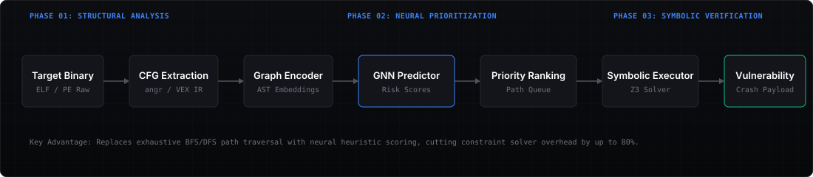
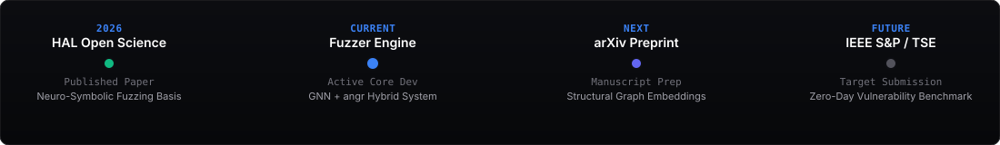

  <!-- Custom Hero Banner -->
  

   

  <!-- Hero Typing Effect -->
  

---

### INTRODUCTION

Computer Science (Data Science) undergraduate exploring the intersection of graph learning, symbolic execution, and software security.

Currently building a **Neuro-Symbolic Fuzzer** that combines Graph Neural Networks with symbolic execution to prioritize high-risk execution paths during binary analysis.

---

### FLAGSHIP RESEARCH: NEURO-SYMBOLIC FUZZER

Systematic discovery of zero-day vulnerabilities in compiled binaries by resolving constraint solver bottlenecking.

#### The Problem & Solution
- **The Bottleneck**: Traditional symbolic execution engines (like `angr` using `Z3`) suffer from combinatorial path explosion when exploring complex binaries, stalling constraint solvers on deep paths.
- **The Solution**: Graph Neural Networks encode control-flow graphs (CFGs) and assembly ASTs into dynamic representations, predicting high-risk execution paths so symbolic execution can prioritize vulnerability-rich code blocks.

#### System Architecture

  

#### Research Timeline

  

---

### TECH STACK

`Python` • `C++` • `PyTorch` • `NetworkX` • `angr` • `Z3 SMT` • `FastAPI` • `Docker` • `Git` • `Linux`

---

### METRICS

  
  
  

---

### CONNECT

[LinkedIn](https://linkedin.com/in/sandy191020) &nbsp;•&nbsp; [Email](mailto:sandeep@research.dev) &nbsp;•&nbsp; [Portfolio](https://sandeep.dev)
