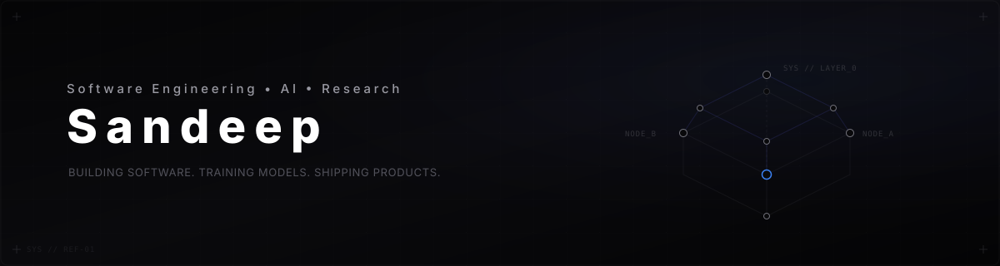

  <!-- Custom Hero Banner -->
  

   

  <!-- Hero Typing Animation -->
  

---

### ABOUT ME

I am a software engineer, backend developer, and AI practitioner focused on building high-performance products and developer tools.

My work lies at the intersection of robust backend systems, scalable AI architectures, and developer-focused tooling. I enjoy designing clean API architectures, optimizing distributed databases, and deploying machine learning models in production environments. When engineering hard problems, I leverage program analysis and machine learning research to build tools that are deterministic, fast, and secure.

---

### TECH STACK

- **Languages**: Python, C++, Java, TypeScript, SQL
- **Backend**: FastAPI, Node.js, Express, REST & gRPC APIs
- **Frontend**: React, Next.js, HTML5/CSS3
- **AI / ML & Research**: PyTorch, TensorFlow, NetworkX, angr, Z3 Solver
- **Databases & DevOps**: PostgreSQL, MongoDB, Docker, Git, Linux, GitHub Actions

---

### WHAT I BUILD

- **AI & Product Engineering**: Intelligent user applications, semantic search tools, and agentic workflows.
- **Web & Backend Architecture**: High-throughput web services, robust database schemas, and modular API design.
- **Developer Tools & Automation**: CLI utilities, custom scripting systems, and continuous integration pipelines.
- **Systems & Security Research**: Graph-guided program exploration, symbolic execution, and static code representation.

---

### FEATURED PROJECTS

#### **[Neuro-Symbolic Fuzzer](https://github.com/youknowme19/graph_z3)**
*A hybrid program analysis framework guiding symbolic execution using graph neural networks.*
- **Stack**: `Python` • `PyTorch` • `angr` • `Z3 Solver` • `C++`
- Prioritizes high-risk execution paths identified by GNN models over control-flow graphs, mitigating state explosion.

#### **[Chrome LinkedIn Assistant](https://github.com/youknowme19/LinkedIn-Smart-Greet)**
*A developer-focused browser extension utilizing LLMs for context-aware networking.*
- **Stack**: `TypeScript` • `React` • `Chrome Extension API` • `OpenAI API`
- Automates and drafts personalized networking messages based on candidate profiles, optimizing outreach pipelines.

#### **[Open Source Contributions](https://github.com/youknowme19)**
*Active contributions to dev tools, developer utilities, and backend libraries.*
- **Stack**: `Git` • `GitHub Actions` • `Community Tooling`
- Fixed performance bottlenecks, updated documentation, and optimized test suites across community repositories.

---

### CURRENT FOCUS

- Building and deploying production-ready AI applications and agentic workflows.
- Deepening expertise in distributed backend architectures and high-performance computing.
- Contributing to open-source developer tools and developer experience tooling.
- Researching intelligent software analysis techniques and program representation.

---

### CONNECT

[GitHub](https://github.com/youknowme19) &nbsp;•&nbsp; [LinkedIn](https://www.linkedin.com/in/sandeep-research/) &nbsp;•&nbsp; [Email](mailto:sand.eepn@1910@gmail.com)
