<div align="center">

  <!-- Custom SVG Banner -->
  

  <br/><br/>

  <!-- Animated Hero Typing Effect -->
  <a href="https://readme-typing-svg.demolab.com">
    
  </a>

</div>

<br/>


<br/>

## ── OVERVIEW

Computer Science (Data Science) undergraduate specializing in AI Security and automated vulnerability discovery. My focus spans the intersection of neural graph representations, symbolic execution engines, and full-stack software development. 

Rather than treating AI models as black boxes or security as an afterthought, I engineer hybrid systems capable of reasoning about complex software behavior, isolating high-risk binary execution paths, and producing deterministic proofs of vulnerability.

### Core Focus Areas

- **AI Security & Vulnerability Analysis**: Combining neural path prioritization with constraint solvers (angr, Z3) to eliminate path explosion in symbolic execution.
- **Neuro-Symbolic AI**: Integrating structural graph reasoning with deterministic mathematical logic for robust code auditing.
- **Developer Infrastructure & Tooling**: Building low-latency, scalable full-stack interfaces and developer platforms.

<br/>


<br/>

## ── TERMINAL LOG

<div align="center">
  
</div>

<br/>


<br/>

## ── RESEARCH & PUBLICATIONS

Engineering systems that bridge formal mathematical verification and deep neural representations.

| Focus Area | Core Technologies / Methodologies | Research Vision |
| :--- | :--- | :--- |
| **Neuro-Symbolic Fuzzing** | GNNs, angr, Z3, PyTorch | Accelerating binary path traversal via learned guidance heuristics |
| **Binary Vulnerability Discovery** | Control-Flow Graphs (CFG), Intermediate Representation (IR) | Detecting zero-day heap corruption and buffer overflows before runtime |
| **Graph Neural Networks** | NetworkX, PyTorch Geometric, AST / CFG Embeddings | Learning structural representations of compiled code blocks |
| **Symbolic Execution** | SMT Solvers, Path Constraint Solving | Generating precise inputs that trigger specific program states |

### Publications & Manuscripts

```
[01]  "Towards Neuro-Symbolic Fuzzing: Prioritizing Execution Paths via Graph Neural Networks"
      Status : Published
      Venue  : HAL Open Science Archive
      Link   : https://hal.science/

[02]  "Automated Binary Vulnerability Discovery with Structural Graph Embeddings"
      Status : Manuscript in Preparation
      Venue  : arXiv (Targeted)

[03]  "Hybrid Symbolic-Neural Analysis for Zero-Day Vulnerability Identification"
      Status : Target Submission
      Venue  : IEEE Transactions on Software Engineering / IEEE S&P
```

<br/>


<br/>

## ── FEATURED PROJECTS

<table>
  <tr>
    <td width="50%" valign="top">
      <h3 align="left">01. Neuro-Symbolic Fuzzer</h3>
      <p align="left"><strong>AI Security &amp; Binary Analysis Engine</strong></p>
      <p align="left">A hybrid vulnerability discovery framework integrating Graph Neural Networks with symbolic execution (angr / Z3) to prioritize high-risk binary paths and prevent path explosion.</p>
      <p align="left">
        <code>Python</code> &nbsp; <code>PyTorch</code> &nbsp; <code>angr</code> &nbsp; <code>Z3 Solver</code> &nbsp; <code>C++</code>
      </p>
    </td>
    <td width="50%" valign="top">
      <h3 align="left">02. LeetCode Tracker</h3>
      <p align="left"><strong>Automated Problem Solving Architecture</strong></p>
      <p align="left">Production-grade automated system that synchronizes, categorizes, and benchmarks algorithmic solution submissions with real-time analytics and dynamic Markdown generation.</p>
      <p align="left">
        <code>Node.js</code> &nbsp; <code>TypeScript</code> &nbsp; <code>GraphQL</code> &nbsp; <code>GitHub Actions</code>
      </p>
    </td>
  </tr>
  <tr>
    <td width="50%" valign="top">
      <h3 align="left">03. LinkedIn AI Assistant</h3>
      <p align="left"><strong>Intelligent Agent &amp; Workflow Automation</strong></p>
      <p align="left">Context-aware conversational agent utilizing local LLM embeddings and structural context parsing to draft tailored, professional communication and streamline networking workflows.</p>
      <p align="left">
        <code>Python</code> &nbsp; <code>FastAPI</code> &nbsp; <code>LangChain</code> &nbsp; <code>React</code> &nbsp; <code>Tailwind</code>
      </p>
    </td>
    <td width="50%" valign="top">
      <h3 align="left">04. Portfolio Website</h3>
      <p align="left"><strong>Minimalist Engineering Showcase</strong></p>
      <p align="left">High-performance personal web platform designed with high-density visual hierarchy, dark mode aesthetics, dynamic micro-interactions, and sub-100ms load latency.</p>
      <p align="left">
        <code>Next.js</code> &nbsp; <code>React</code> &nbsp; <code>Tailwind CSS</code> &nbsp; <code>TypeScript</code> &nbsp; <code>Vercel</code>
      </p>
    </td>
  </tr>
</table>

<br/>


<br/>

## ── TECHNICAL STACK

<table width="100%">
  <tr>
    <td width="20%" stroke="none"><strong>Languages</strong></td>
    <td><code>Python</code> &nbsp; <code>Java</code> &nbsp; <code>C++</code> &nbsp; <code>TypeScript</code> &nbsp; <code>C</code></td>
  </tr>
  <tr>
    <td><strong>AI / Research</strong></td>
    <td><code>PyTorch</code> &nbsp; <code>TensorFlow</code> &nbsp; <code>NetworkX</code> &nbsp; <code>angr</code> &nbsp; <code>Z3 SMT</code></td>
  </tr>
  <tr>
    <td><strong>Backend</strong></td>
    <td><code>FastAPI</code> &nbsp; <code>Node.js</code> &nbsp; <code>Express</code> &nbsp; <code>REST / GraphQL</code></td>
  </tr>
  <tr>
    <td><strong>Frontend</strong></td>
    <td><code>React</code> &nbsp; <code>Next.js</code> &nbsp; <code>Tailwind CSS</code> &nbsp; <code>HTML5 / CSS3</code></td>
  </tr>
  <tr>
    <td><strong>Databases</strong></td>
    <td><code>PostgreSQL</code> &nbsp; <code>MongoDB</code> &nbsp; <code>Redis</code></td>
  </tr>
  <tr>
    <td><strong>DevOps &amp; Tools</strong></td>
    <td><code>Docker</code> &nbsp; <code>Git</code> &nbsp; <code>Linux</code> &nbsp; <code>GitHub Actions</code> &nbsp; <code>Vercel</code></td>
  </tr>
</table>

<br/>


<br/>

## ── METRICS & ANALYTICS

<div align="center">

  <table border="0">
    <tr>
      <td width="50%">
        
      </td>
      <td width="50%">
        
      </td>
    </tr>
    <tr>
      <td width="50%">
        
      </td>
      <td width="50%">
        
      </td>
    </tr>
  </table>

  <br/>

  <!-- Contribution Graph Activity -->
  

  <br/><br/>

  <!-- Contribution Snake -->
  <picture>
    <source media="(prefers-color-scheme: dark)" srcset="assets/github-contribution-grid-snake-dark.svg">
    <source media="(prefers-color-scheme: light)" srcset="assets/github-contribution-grid-snake.svg">
    
  </picture>

</div>

<br/>


<br/>

## ── CONNECT

<div align="left">

- **LinkedIn**: [linkedin.com/in/sandy191020](https://linkedin.com/in/sandy191020)
- **Portfolio**: [sandeep.dev](https://sandeep.dev)
- **Email**: [sandeep@research.dev](mailto:sandeep@research.dev)

</div>

<br/>


<br/>

<div align="center">
  <p align="center"><code>Building things worth using.</code></p>
  
</div>
